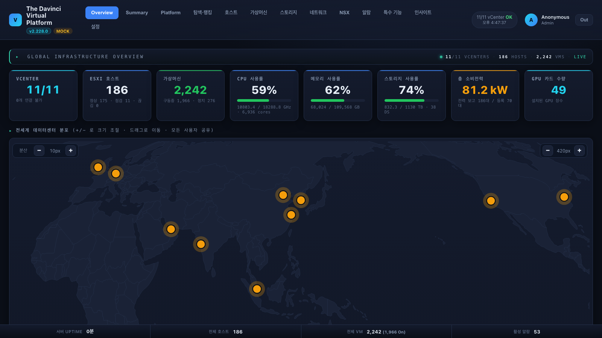
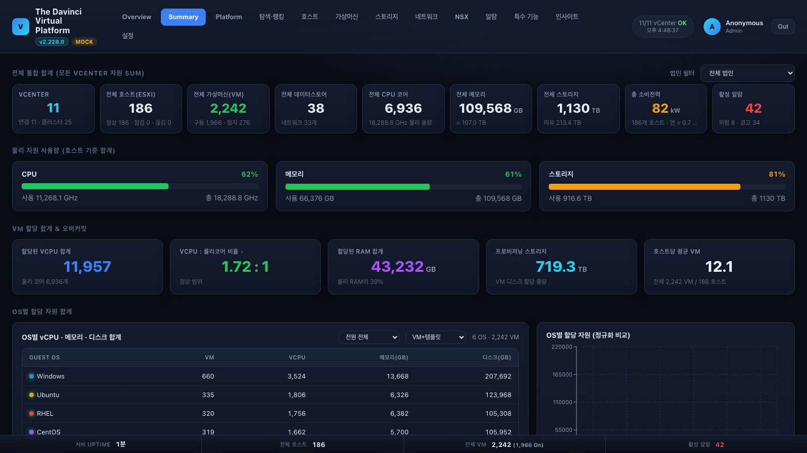
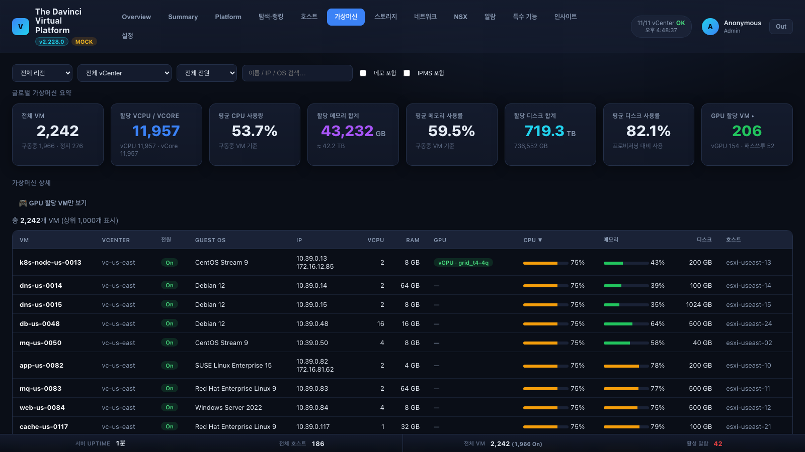
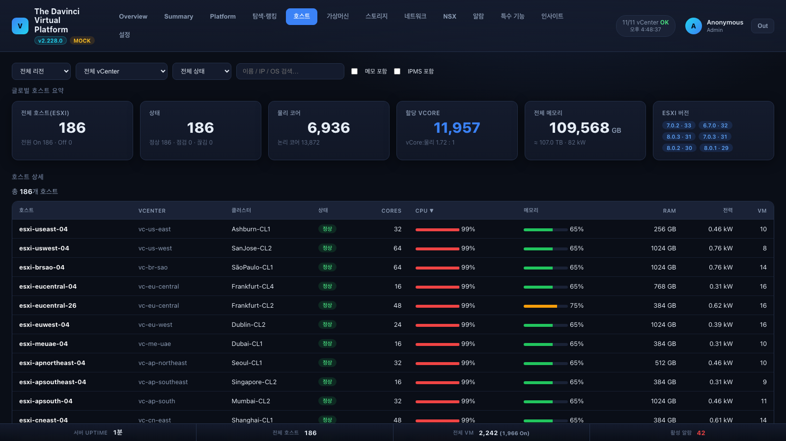
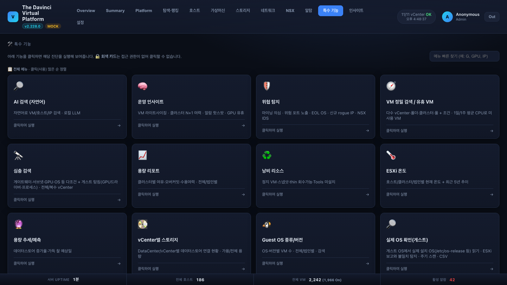
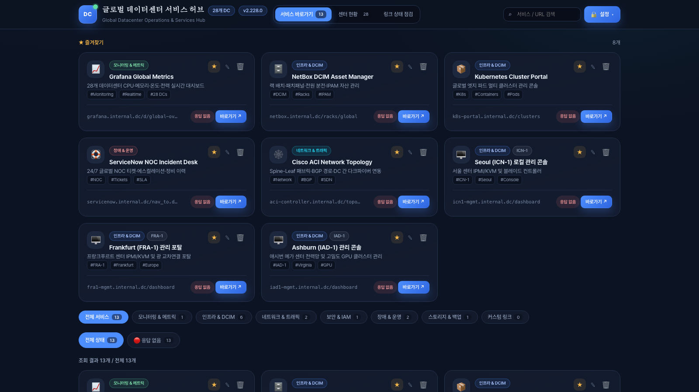

# 처음 사용자 가이드 — VMware Global Monitoring Portal

포탈을 처음 쓰는 분을 위한 안내입니다. 조회 위주로, 꼭 알아야 할 것만 담았습니다.
(중급 기능은 [GUIDE-INTERMEDIATE.md](GUIDE-INTERMEDIATE.md), 관리는 [GUIDE-ADMIN.md](GUIDE-ADMIN.md))

> 📷 이 문서의 화면은 데모(mock) 모드 캡처입니다 — 실제 환경도 구성은 동일합니다.

---

## 1. 접속과 로그인

- 브라우저로 포탈 주소(예: `https://portal.example.com`)를 엽니다. 로그인 화면은 20종 디자인 중
  하나가 무작위로 나옵니다(우하단 🎲로 교체 가능 — 기능은 모두 동일).
- **계정 + 비밀번호**(viewer) 또는 **계정 + OTP 6자리**(admin/operator)로 로그인합니다.
  고권한 계정은 비밀번호가 없고 **OTP 전용**입니다 — 처음 발급받은 계정이라면 첫 로그인 때
  OTP 등록 화면이 자동으로 뜹니다(휴대폰 인증앱으로 QR 스캔).
- 로그인이 안 되면: 비밀번호/OTP 5회 실패 시 잠금 — 관리자에게 해제를 요청하세요.

## 2. 화면 구성

상단 탭이 기능의 전부입니다. 처음에는 이 다섯 개만 기억하면 됩니다:

| 탭 | 용도 |
|---|---|
| **Overview** | 전세계 KPI(vCenter/호스트/VM/CPU/메모리/스토리지/전력/GPU) + 세계지도. 매일 첫 화면 |
| **호스트 / 가상머신 / 스토리지** | 자원 목록 — 정렬·검색·필터 |
| **알람** | 전 vCenter 알람 모음(심각도별) |
| **특수 기능** | 리포트·분석 도구 모음(아래 4절) |

**통합 서머리** 탭은 전 vCenter 자원을 하나로 합산해 보여줍니다(개수·용량·오버커밋·전력·OS 분포):

- 화면은 **자동 갱신**됩니다(15~60초 폴링) — 새로고침(F5)을 누를 필요가 없습니다.
- 상단 필터바에서 **리전/vCenter(법인)** 를 고르면 모든 화면이 그 범위로 좁혀집니다.
- 일시적으로 "갱신 실패" 배너가 떠도 직전 데이터가 유지됩니다 — 잠시 후 자동 복구됩니다.

## 3. 자원 찾아보기

- **가상머신** 탭에서 이름 일부로 검색합니다(예: `web`). 열 머리글 클릭으로 정렬.
- VM 이름을 클릭하면 **상세 팝업**(사양·IP·호스트·데이터스토어·성능 그래프)이 뜹니다.
- **호스트** 탭도 같은 방식입니다 — CPU/메모리 사용률, 온도, 전력이 함께 보입니다.

## 4. 특수 기능 — 원하는 답을 바로 주는 도구들

상단 **특수 기능** 탭에 50개 이상의 도구가 카드로 정리되어 있습니다.

- 우상단 **"메뉴 빠른 찾기"** 에 키워드(예: `GPU`, `IP`, `스냅샷`)를 치면 바로 좁혀집니다.
- 자주 쓰는 카드가 위로 올라오고, 각 도구는 `#/tools/<이름>` 주소로 **북마크**할 수 있습니다.
- **🔒 회색 카드**는 내 계정에 권한이 없는 것입니다 — 필요하면 관리자에게 요청하세요.

처음 써보기 좋은 도구: **Guest OS 종류/버전**(우리 환경의 OS 분포), **스냅샷 있는 VM**,
**중복 IP 찾기**, **ESXi 온도**, **일일 헬스체크 리포트**(아침 점검 요약).

## 5. 서비스 허브 — 운영 포탈 바로가기 모음 (별도 페이지)

특수 기능의 **"서비스 허브"** 카드(또는 별도 주소 `:8095`)로 열리는 **독립 페이지**입니다.
Grafana·NetBox·ServiceNow 같은 운영 포탈 바로가기를 한곳에 모아 두고, 각 링크의
**응답 상태(🟢/🔴)** 를 자동 점검해 보여줍니다.

- 카드 클릭 = 새 탭으로 이동. 상단 검색은 **두 단어 이상**(예: `grafana 서울`)도 됩니다.
- 카테고리 칩·상태 칩(정상/응답 없음)으로 좁혀 볼 수 있습니다.
- 조회는 로그인 없이 가능하고, 등록/수정은 설정 로그인(관리자)이 필요합니다.

## 6. 자주 묻는 질문

- **화면이 안 바뀌어요** → 자동 폴링 중입니다. 탭이 백그라운드면 절전을 위해 멈췄다가 돌아오면 즉시 갱신됩니다.
- **어떤 vCenter는 안 보여요** → 계정에 **데이터 범위(scope)** 가 지정된 경우입니다(예: 유럽 법인 계정은 유럽만). 관리자 설정 사항입니다.
- **버튼이 없어요/회색이에요** → 기능별 권한이 꺼져 있는 것입니다. 화면에서 숨기지 않고 잠금으로 보여주므로, 그대로 관리자에게 요청하면 됩니다.
