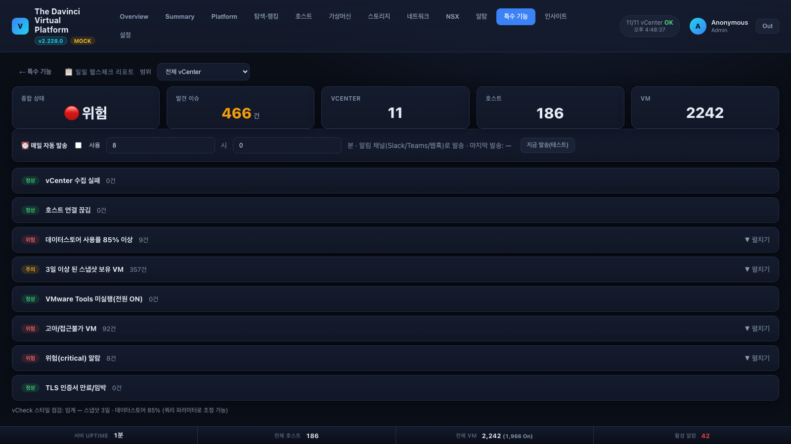
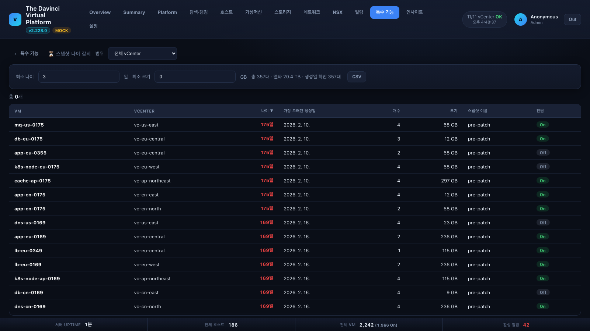
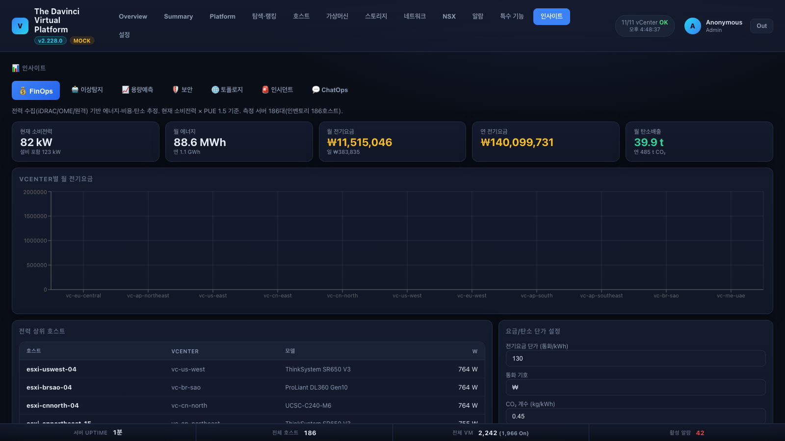

# 중급 사용자 가이드 — 운영 실무 기능 활용

기본 조회([GUIDE-BEGINNER.md](GUIDE-BEGINNER.md))에 익숙해진 운영자를 위한 실무 기능 안내입니다.
관리 기능(등록·권한·업그레이드)은 [GUIDE-ADMIN.md](GUIDE-ADMIN.md)를 보세요.

---

## 1. 운영 리포트 10종 (특수 기능, v2.217+)

커뮤니티 표준 점검 항목(vCheck·RVTools 스타일)이 특수 기능에 내장되어 있습니다.
전부 vCenter 범위(법인) 선택과 CSV 내보내기를 지원합니다.

### 일일 헬스체크 리포트 (`#/tools/daily-health`)

스냅샷·데이터스토어 용량·Tools 미실행·연결 끊김·고아 VM·위험 알람·인증서 만료를
**한 화면 요약**으로 봅니다. 섹션을 클릭하면 해당 목록이 펼쳐집니다.
관리자는 **매일 지정 시각 웹훅(Slack/Teams) 자동 발송**을 켤 수 있습니다.

### 스냅샷 나이 감시 (`#/tools/snapshot-age`)

"N일 이상 된 스냅샷"을 생성일 기준으로 찾습니다(나이·크기 필터). 오래된 스냅샷은
성능 저하·스토리지 잠식의 단골 원인입니다 — 주 1회 점검을 권장합니다.

### 나머지 8종 요약

| 도구 | 언제 쓰나 |
|---|---|
| 🧟 좀비/방치 리소스 | 고아·접근불가 VM, 장기 정지 VM, 스냅샷 대식가 — **회수 가능 용량** 추정 |
| 📜 인증서 만료 감시 | vCenter·NSX TLS 만료 D-90/D-30 — 만료 시 로그인 불능 사고 예방 |
| 📐 VM 라이트사이징 | 관측 평균/피크 기반 과대할당 VM 축소 추천(회수 vCPU/RAM 합계) |
| 📉 용량 고갈 예측 | 데이터스토어 증가 추세 → "가득 찰 예상일", 30일 임박 강조 |
| 📣 알림 채널·이력 | 발화 중 알림·최근 발송 이력 조회(설정은 관리자) |
| 📑 버전/패치 준수 | Tools 업그레이드 필요 VM · VM HW 버전 · ESXi 지원종료(EOL) 분포 |
| 🕘 구성 변경 이력 | "누가 언제 무엇을 바꿨나" — 분류/계정/대상 필터 + CSV |
| 🛟 미보호 VM | 백업 소프트웨어의 스냅샷 이벤트가 없는 가동 VM(휴리스틱) |

## 2. 인사이트 탭

💰 FinOps(전력→요금·CO₂) · 🤖 AI 이상탐지 · 📈 용량 예측 · 🛡 보안(빌드↔VMSA/EOL) ·
🌐 토폴로지 · 🚨 인시던트 타임라인. 임계값·단가 등은 관리자 설정을 따릅니다.

## 3. 검색을 잘 쓰는 법

- **VM 정밀 검색/유휴 VM** (`#/tools/vmfinder`) — 폴더·클러스터·리소스풀 + 사양 조건, 1일/1주
  평균 CPU로 **미사용 VM** 판별.
- **심층 검색** (`#/tools/deepsearch`) — 게이트웨이·서브넷(CIDR)·OS·GPU 등 다조건. 게스트 탐침
  (GPU 드라이버·특정 프로세스)까지.
- **AI 자연어 검색** — "북미에서 메모리 90% 넘는 호스트" 같은 문장으로 검색(로컬 LLM 구성 시).

## 4. IP 관리대장 (IPAM)

- `#/tools/ipam` — vCenter가 수집한 전 IP + 능동 스캔으로 보강된 물리 장비 IP까지 한 대장으로.
  서브넷별 엑셀형 시트, 중복 IP 탐지(`#/tools/dupip`), CSV/XLSX 내보내기.
- IP를 클릭하면 소유 VM/호스트 상세로 연결됩니다. 관리상태(예약/폐기예정 등)는 운영자가 지정.

## 5. 원격 접속 · VM 작업

- VM 상세 팝업에서 **콘솔**(VMRC/웹), **SSH**(브라우저 터미널), **RDP**(브라우저/.rdp 다운로드)를
  바로 엽니다 — 권한(`remote.access`, `vm.console`)이 있는 계정만 버튼이 활성화됩니다.
- **VM 사양 변경**(vCPU/RAM/디스크 증설)과 **VM 생성**은 operator/admin 권한 + 확인창을 거칩니다.

## 6. 알람 운영

- **알람** 탭에서 심각도·vCenter별로 모아 봅니다. 반복되는 무의미한 알람은 **음소거 규칙**으로
  숨길 수 있습니다(대상·종류 기준, 관리 권한 필요).
- 알림 채널(Slack/Teams/웹훅)이 설정돼 있으면 위험 알람이 자동 발송됩니다 — 같은 알람은
  쿨다운·중복 억제로 스팸이 되지 않습니다.

## 7. 서비스 허브 실무 (설정 로그인 필요)

- **바로가기 등록/수정** — 이름+URL만으로 카드 생성. 카테고리는 목록에서 고르거나
  **"＋ 새 카테고리 만들기…"** 로 즉석 생성. 관리 표에서는 **카테고리 드롭다운으로 즉시 변경**.
- **사용/중지** — 안 쓰는 링크는 삭제 대신 [⏸ 중지]: 대시보드·상태 점검에서 빠지고 [▶ 사용]으로 복귀.
- **대량 등록** — CSV/JSON 가져오기(추가/교체 선택, 일괄 카테고리 지정, 실패 행은 사유 표시).
  서버에 파일을 올려 두고 **[🗂 서버 파일 가져오기]** 로 업로드 없이 반영할 수도 있습니다.
- **점검 이력 차트** — 링크별 가용률·응답 지연을 5분~한달 구간으로.

## 8. 내보내기 팁

목록 화면과 리포트 대부분에 **CSV** 버튼이 있습니다 — UTF-8 BOM이라 엑셀에서 한글이 바로
열립니다. 대량 시계열(GPU 등)은 서버가 청크로 안전하게 내보냅니다.

## 9. VM 수량 · 스토리지 사용량 추이 (v2.345+)

특수 기능의 두 카드가 **매일 00시·12시 스냅샷**(전용 `vm-track.db`)으로 변화를 추적합니다.

### VM 수량 추이 (`#/tools/vm-track`)
- 총 VM · 켜짐/꺼짐 · 생성/삭제 · 전원 전환(Off↔On)을 전체/단위 vCenter 로 차트·표.
- 표의 **증감 숫자(+N/−N, ↑N/↓N)를 클릭**하면 그 시각에 어떤 VM 이 어느 클러스터·호스트·
  데이터스토어에 생기고 사라졌는지 목록으로 봅니다.
- 관리자는 **⚡ 지금 스냅샷**으로 즉시 채집(같은 슬롯이면 최신 값으로 갱신).

### 스토리지 사용량 추이 (`#/tools/storage-track`)
- 합계 차트: **파란 총 용량 한도선 + 슬롯별 주황 사용량 막대** — 소진 상황이 바로 읽힙니다.
- vCenter 선택 시 그 vCenter 의 **데이터스토어 각각의 미니 차트 그리드**(12개씩 페이지).
- **스토리지 변경 이력**: 시각별(슬롯 행 + 변화한 DS 칩) / DS별(최근 슬롯 증감 피벗) 두 보기.
  칩·행을 클릭하면 그 DS 의 추이 차트가 뜹니다. 상단 '스토리지' 탭 각 행의 📈 버튼도 동일.
- '일평균 증가'와 '가용 소진 ~N일'은 **선형 추정**입니다(실측 기간의 평균 속도 유지 가정).
- 개별 DS 시계열은 v2.353 설치 후 첫 스냅샷부터 쌓입니다 — 과거 값은 소급하지 않습니다.

